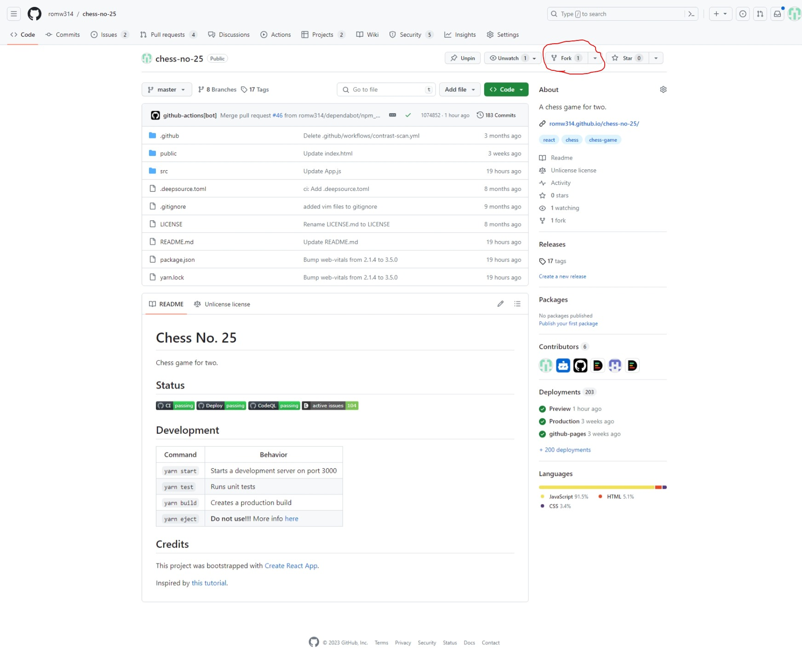
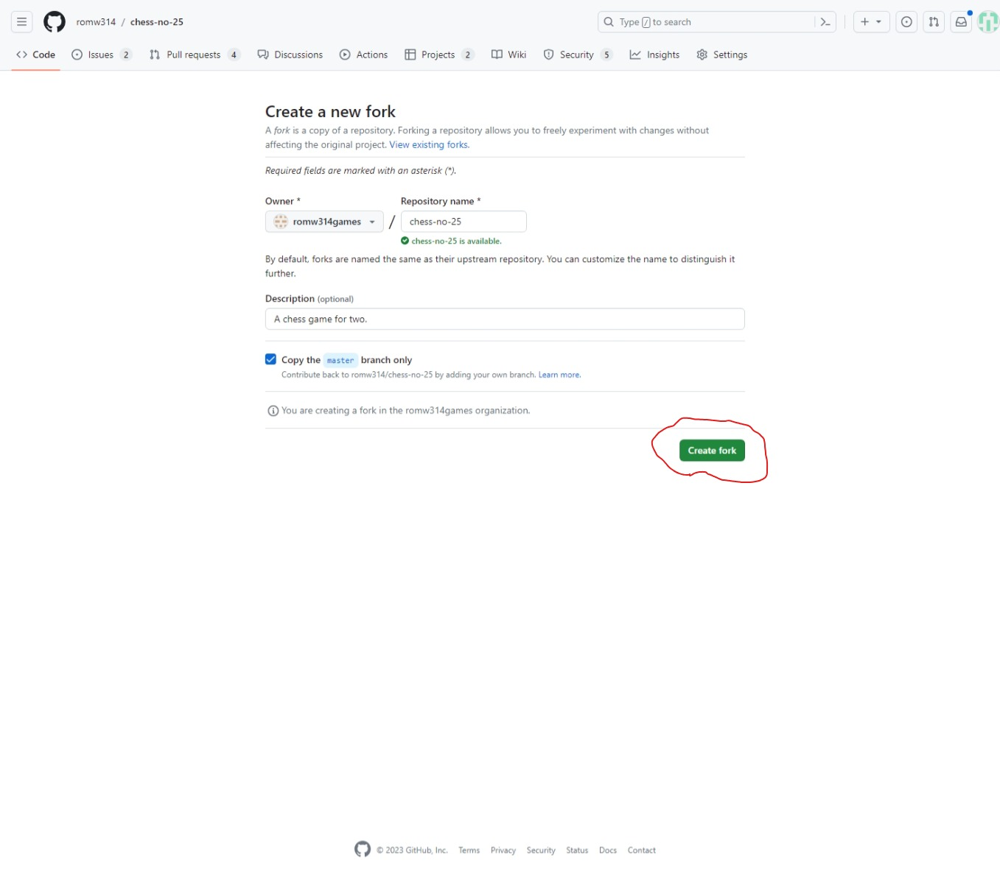
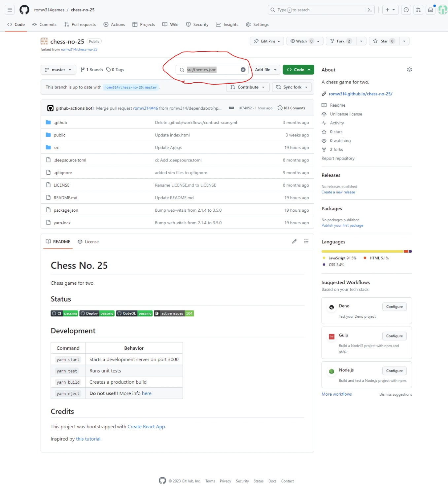
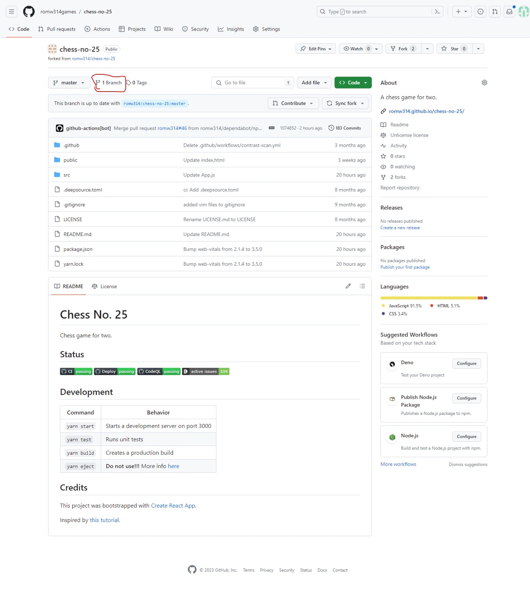
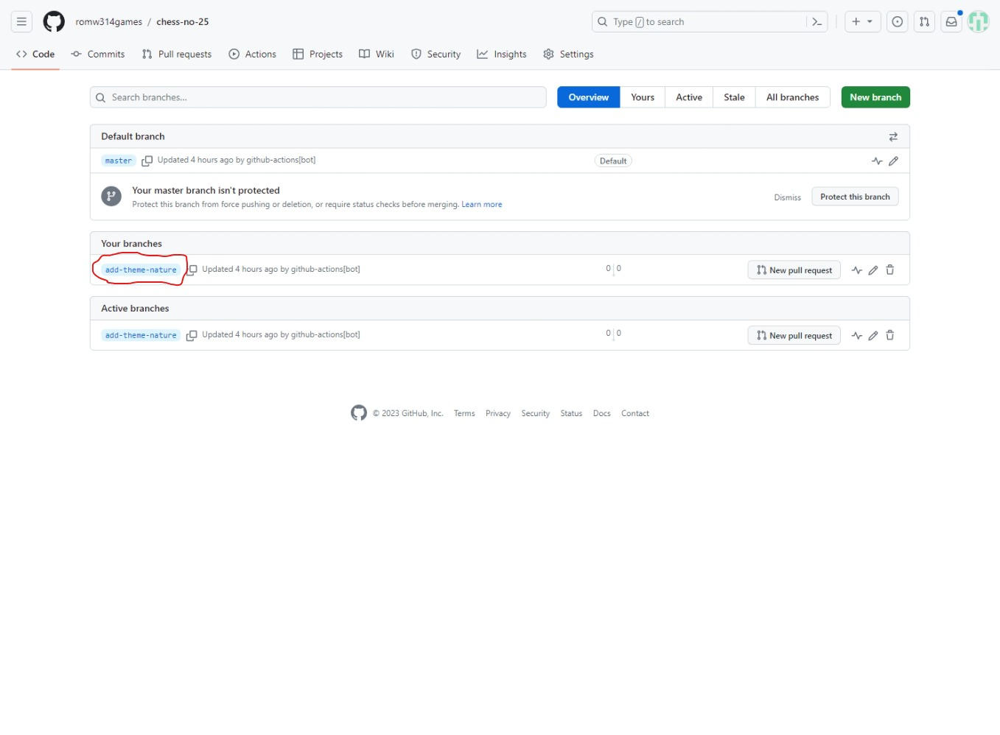
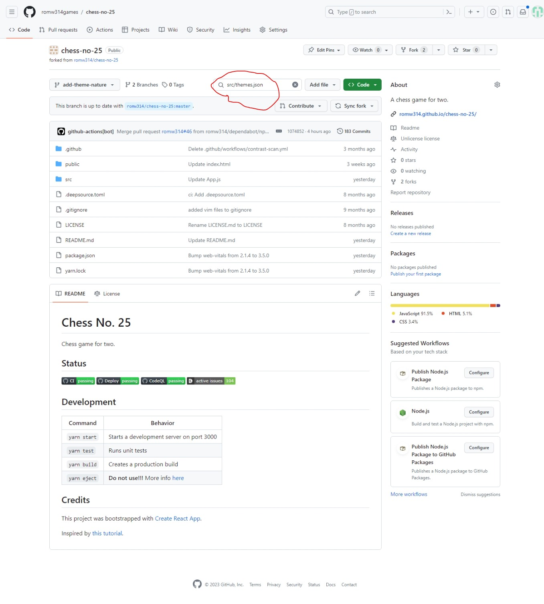
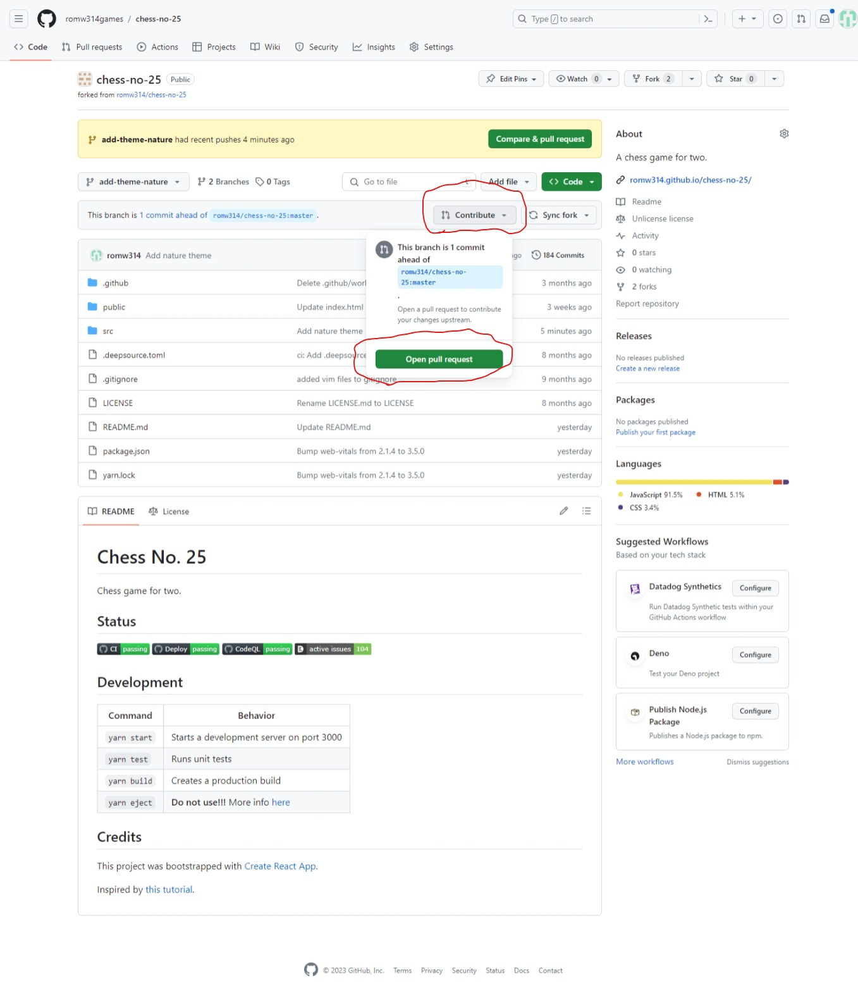
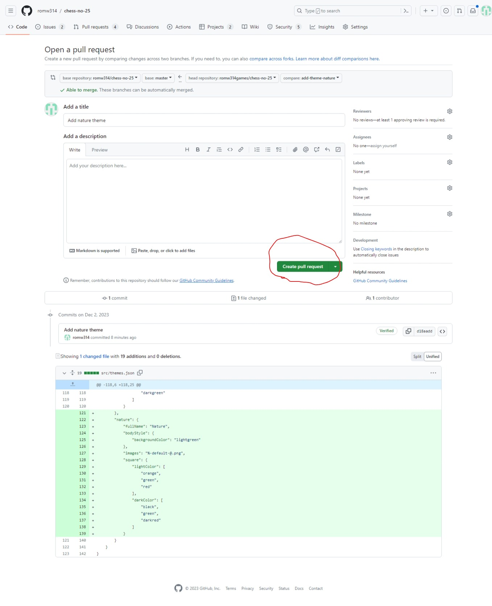
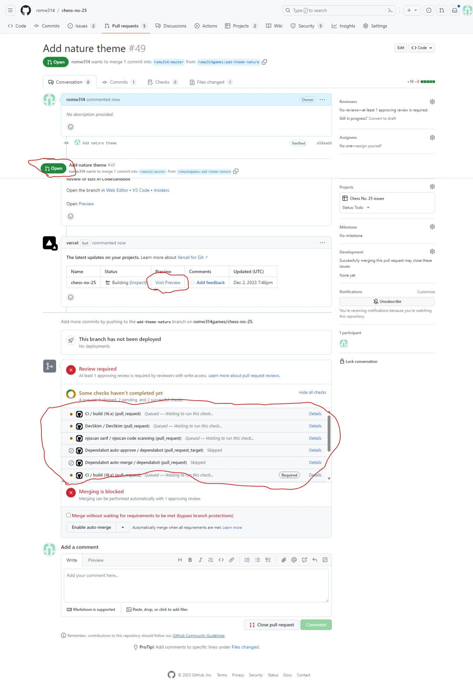
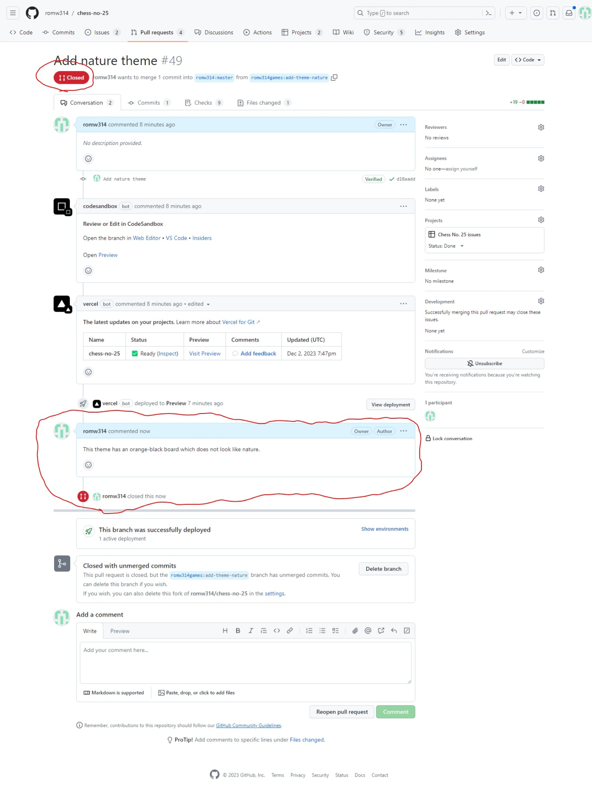

# Tutorial: Creating your custom theme for Chess No. 25

## Prerequisites

To create you own theme for Chess No. 25, you will need a GitHub account, a web browser and an internet connection.
If you don't have a GitHub account already you can [create a new one](https://github.com/signup){:target=blank}.

## 1. Fork Chess No. 25

> ***NOTE:***
> If you have already forked Chess No. 25, you can skip this step.

To start, [sign in to GitHub](https://github.com){:target=blank} and navigate to [the Chess No. 25 repository](https://github.com/romw314/chess-no-25){:target=blank}.

You should see something like this:


Click the `Fork` button.

You should see something like this:


Click the `Create fork` button. After a short time, it should take you into the newly created fork

## 2. Choose what theme do you want to create

Choose what theme do you want to create and choose a proper and internal name.

The internal name should be one of these:

* The full name of the theme, but in camel case: special characters like `&` are removed, each word except the first starts with a capital letter and the first word is lowercase.
* An abbreviation of the full name of the theme.

For example, if you are creating a theme named `Lava`, the internal name should be `lava`.

Another example: if you are creating a theme named `Lavender & Vanilla`, the internal name should be `lavenderVanilla`, `lavenderAndVanilla` or `lv`.

## 3. Ensure that the theme do you want to create does not exist

Go to your newly created fork of Chess No. 25 on GitHub and enter `src/themes.json` into the `Go to file` text box. It should find a file named `src/themes.json` in the repository. Open the file by clicking it.



When the file opens, you should see something like this:

```json
{
	"themes": {
		"default": {},
		"dark": {
			"fullName": "Dark (default)",
			"bodyStyle": {
				"backgroundColor": "black",
				"color": "white"
			},
			"style": {
				"opacity": "0.8"
			},
			"images": "%-default-@.png",
			"square": {
				"lightColor": [
					"#333333",
					"darkgreen",
					"orange"
				],
				"darkColor": [
					"#111111",
					"darkgreen",
					"darkred"
				]
			}
		}
	}
}
```

So, let's explain the code. The code is spliited into "sections". The root section does not have a name. A section looks like this:

```json
{
	"a": 1,
	"b": {
		"a": "hello",
		"b": {
			"a": true
		}
	}
}
```

Every section has it's "childs". A child can be a string (text) wrapped in double quotes, a number, a boolean (`true` or `false`) or a sub-section. The section above has two childs: `a`, and `b`. `a` is a number, `b` is a sub-section which has two childs:

* `a` - a string
* `b` - a sub-section (because it's a child of `b`, we'll call it `b.b`)

Please note that `2` and `"2"` are diferrent. `2` is a number while `"2"` is a string.

A child can also be an array (a list of strings, numbers, booleans or sections).

In our example, `b.b.a` is a boolean (`true`).

In our themes.json, the root section has only one child - the `themes` section.

Each theme is a child of the `themes` section. For example, the dark theme (with full name `Dark` and internal name `dark`) is in the `themes.dark` section (not `themes.Dark`) and it's full name is in `themes.dark.fullName`.

Check if the `themes` section in the GitHub repository has a child with name same as the internal name of your theme.

Also check for other names. For example, if you are creating a theme named `Lavender & Vanilla` with internal name `lavenderVanilla`. Also check for themes named something like `lavenderAndVanilla`, `lavenderPlusVanilla`, `lv` or `vanillaLavender`.

## 4. Write the code for your theme

Go to your forked Chess No. 25 repo and click something like `1 Branch` or `2 Branches`.



Click `New branch` and enter some unique name for this branch. For example, if you are creating a theme named `Nature`, you can name it `add-theme-nature`. Then click `Create new branch`.


Click the created branch (you can click it either in `Your branches` or in `Active branches`).



Enter `src/themes.json` into the `Go to file` text box and open the `src/themes.json` file.



Click the edit icon.


> Remember:
>
> A "section" is something wrapped in braces (`{}`) that can have "childs".
>
> A "child" can be a sub-section, a number, a string (text), a boolean or an array.
>
> An array is a list of strings, numbers, booleans or sections. An array looks like this: `["hello 1", "second string", "another string", "last string"]`
>
> A string must always be quoted.
>
> A name of a section is a quoted string on the left side of a colon (`:`).

Add your own sub-section to the `themes` section of the theme. The name of the section should be the internal name of your theme (**important!**). For example, if your theme's internal name is `nature`, the section will be named `nature`.

Your sub-section should have these childs:

Child name  | Type        | Required | Description
----------- | ----------- | -------- | -----------
`fullName`  | String      | Yes      | The full name of the theme
`bodyStyle` | Sub-section | No       | You can set the `backgroundColor` and the `color` childs to [one of these values](https://www.w3schools.com/colors/colors_names.asp) to adjust the background color and text color.
`style`     | Sub-section | No       | You can set the `opacity` child to numbers from 0 to 1 make the game darker or lighter.
`images`    | String      | No       | If you want to use the default images, set this to `%-default-@.png`. Otherwise, do not use this.
`square`    | Sub-section | No       | Sets the square colors. See below

The `square` child of your sub-section should have two childs: `lightColor` and `darkColor`

`square.lightColor` defines the colors of light (white) squares and `square.darkColor` defines the colors of dark (black) squares.

Both `square.lightColor` and `square.darkColor` should be an array of three strings. The first string is the normal color of the square. The second string is the color when there is a selected piece on this square. The third string is the color when the selected piece can move to this square.

When you're done, click `Commit changes`, enter a good message for your change (for example `Add nature theme`) instead of the default `Update themes.json`. Then, click `Commit changes`.


### Example of adding theme

We start with this:

```json
{
	"themes": {
		"default": {},
		"dark": {
			"fullName": "Dark (default)",
			"bodyStyle": {
				"backgroundColor": "black",
				"color": "white"
			},
			"style": {
				"opacity": "0.8"
			},
			"images": "%-default-@.png",
			"square": {
				"lightColor": [
					"#333333",
					"darkgreen",
					"orange"
				],
				"darkColor": [
					"#111111",
					"darkgreen",
					"darkred"
				]
			}
		}
	}
}
```

And we end up with this:

```json
{
	"themes": {
		"default": {},
		"dark": {
			"fullName": "Dark (default)",
			"bodyStyle": {
				"backgroundColor": "black",
				"color": "white"
			},
			"style": {
				"opacity": "0.8"
			},
			"images": "%-default-@.png",
			"square": {
				"lightColor": [
					"#333333",
					"darkgreen",
					"orange"
				],
				"darkColor": [
					"#111111",
					"darkgreen",
					"darkred"
				]
			}
		}
		"nature": {
			"fullName": "Nature",
			"bodyStyle": {
				"backgroundColor": "lightgreen"
			},
			"images": "%-default-@.png",
			"square": {
				"lightColor": [
					"orange",
					"green",
					"red"
				],
				"darkColor": [
					"black",
					"green",
					"darkred"
				]
			}
		}
	}
}
```

## 5. Create a pull request for our theme

When we commited our changes to themes.json, we have the file still open. To return back, click `Code`.


Click `Contribute`, then `Open pull request`.



Click `Create pull request`.



After a while, you will see that auto-checks are running and there is a `Visit Preview` link which you can use to try your theme. You will also see the status which will be `Open`. When the status changes to `Closed`, it means that your new theme is declined. When the status changes to `Merged`, it means that your theme is accepted and you can find it on the [Chess No. 25 nightly version](https://chess-no-25-nightly.vercel.app){:target=blank}.



If the pull request is closed, you can see a comment that describes why it's closed.



